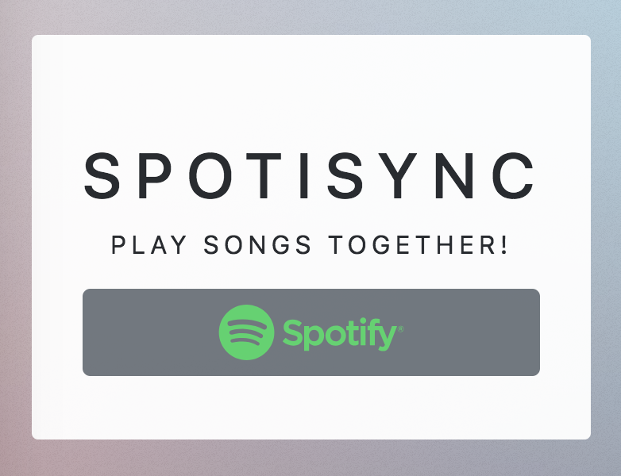

# SpotiSync
Let's try to play music remotely together!

[][mitLink]

## About

SpotiSync is a simple web application designed to synchronous playing of the same Spotify song for users. Live at [https://nguyenjkevin.com/SpotiSync](https://nguyenjkevin.com/SpotiSync). The authentication is done through an API gateway and API calls are done on client devices after session authentication.

## License

`SpotiSync` is released under an [MIT License][mitLink].

**Copyright &copy; 2018-present Kevin J Nguyen.**

*Please provide attribution, it is greatly appreciated.*

[mitLink]:http://opensource.org/licenses/MIT